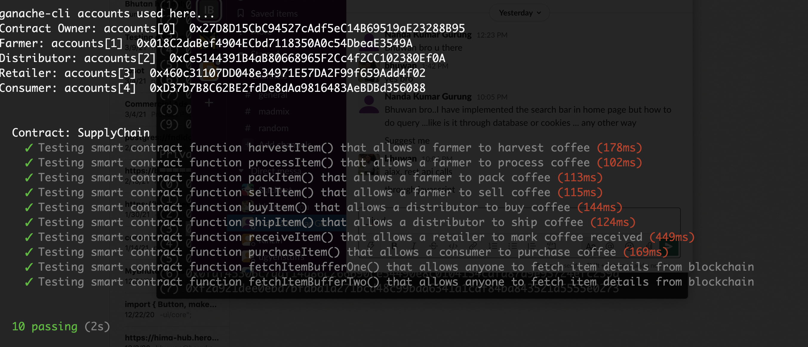

#Ethereum Dapp for Tracking Items through Supply Chain

This repository containts an Ethereum DApp that demonstrates a Supply Chain flow between a Seller and Buyer. The user story is similar to any commonly used supply chain process. A Seller can add items to the inventory system stored in the blockchain. A Buyer can purchase such items from the inventory system. Additionally a Seller can mark an item as Shipped, and similarly a Buyer can mark an item as Received.

# UML Diagrams

## Activity Diagram

The DApp User Interface when running should look like...


## Sequence Diagram


## State Diagram


## Classs Diagram


## Getting Started

These instructions will get you a copy of the project up and running on your local machine for development and testing purposes. See deployment for notes on how to deploy the project on a live system.

### Prerequisites

Please make sure you've already installed ganache-cli, Truffle and enabled MetaMask extension in your browser.

```
Give examples (to be clarified)
```

### Installing

A step by step series of examples that tell you have to get a development env running

Clone this repository:

```
git clone https://github.com/Akbarkz/supply-chain.git
```

Change directory to `project-6` folder and install all requisite npm packages (as listed in `package.json`):

```
cd project-6
npm install
```

Launch Ganache:

```
ganache-cli -m "spirit supply whale amount human item harsh scare congress discover talent hamster"
```

Your terminal should look something like this:


In a separate terminal window, Compile smart contracts:

```
truffle compile
```

Your terminal should look something like this:


This will create the smart contract artifacts in folder `build\contracts`.

Migrate smart contracts to the locally running blockchain, ganache-cli:

```
truffle migrate
```

Your terminal should look something like this:


Test smart contracts:

```
truffle test
```

All 10 tests should pass.



In a separate terminal window, launch the DApp:

```
npm run dev
```

#Important Information

##Rinkbey Deployment Details

1. Contract Address : https://rinkeby.etherscan.io/address/0x893D3a7c006C86d48018d968D04dD34Ad7c00Cf2
   2.Transaction :https://rinkeby.etherscan.io/tx/0x8b4d6a4d979d497c2c599b275502f39e871c8ce49cf4c2e8c2f06d621613a95c

##IPFS
Deployed frontend on IPFS
link : https://gateway.pinata.cloud/ipfs/QmQoXfpUbMPC7tPz86WDds6ZgrAWDtTicJ2BvgiUzmwU9m/
\*\* css is not supported

## Built With

Libraries Used

1.dotenv : For using env variables
2.truffle-assertions : Easy to test events
3.truffle-hdwallet-provider : For configuring providers in test networks
4.husky: Pre commit and pre push hooks

## Dev Tools Version

1. node : 12.13.1
2. Truffle : 5.1.54
   3.Web3 : 1.2.1

## Built With

- [Ethereum](https://www.ethereum.org/) - Ethereum is a decentralized platform that runs smart contracts
- [IPFS](https://ipfs.io/) - IPFS is the Distributed Web | A peer-to-peer hypermedia protocol
  to make the web faster, safer, and more open.
- [Truffle Framework](http://truffleframework.com/) - Truffle is the most popular development framework for Ethereum with a mission to make your life a whole lot easier.

## Authors

See also the list of [contributors](https://github.com/your/project/contributors.md) who participated in this project.

## Acknowledgments

- Solidity
- Ganache-cli
- Truffle
- IPFS
